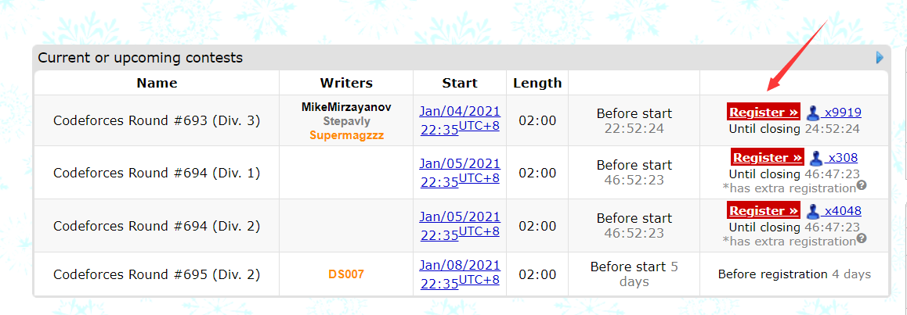
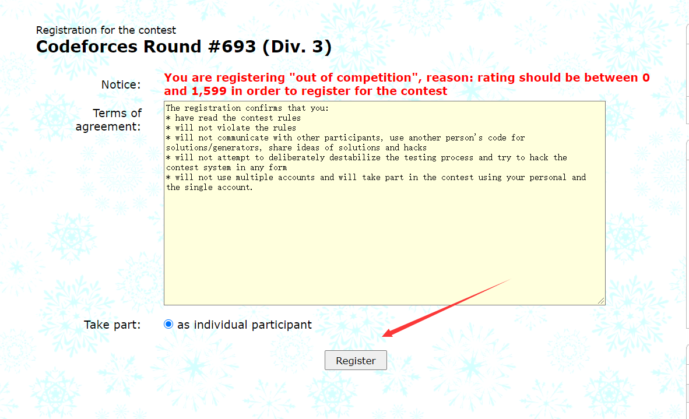
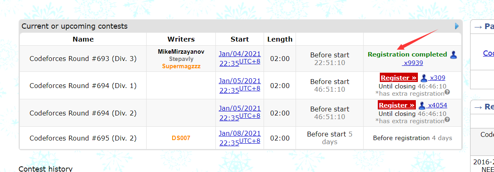
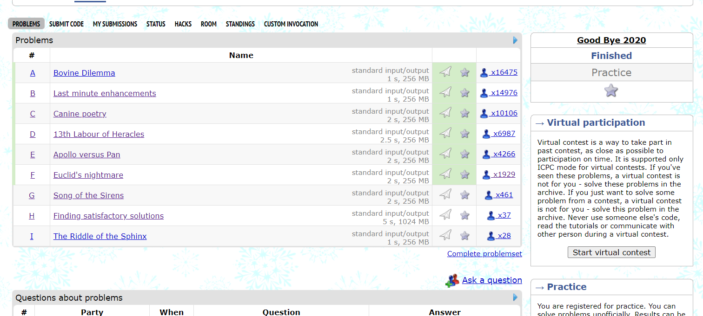
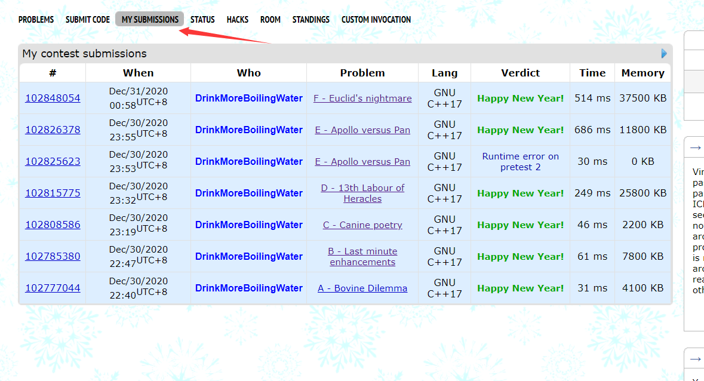
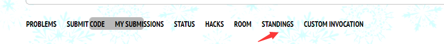
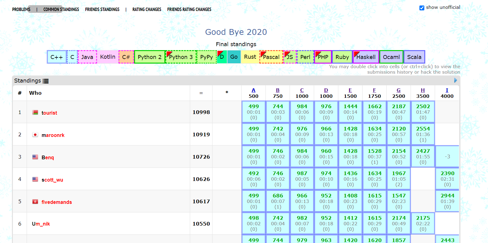
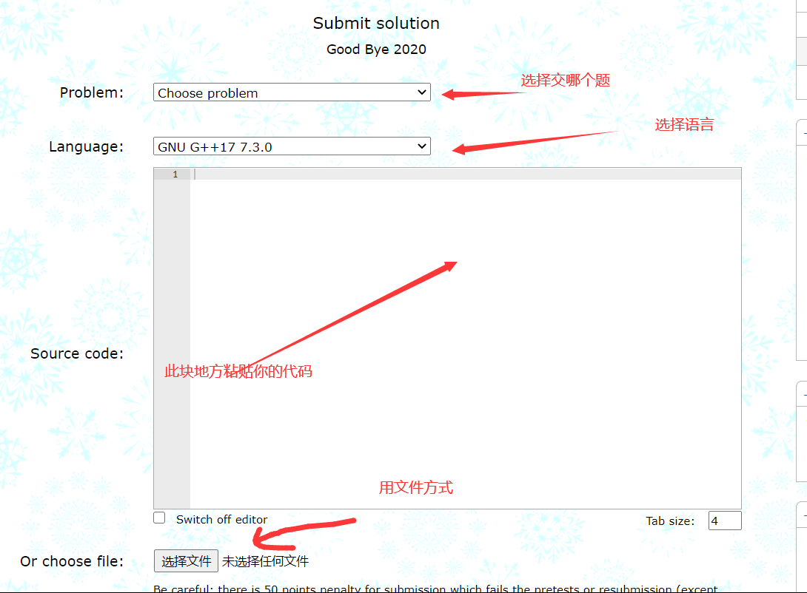
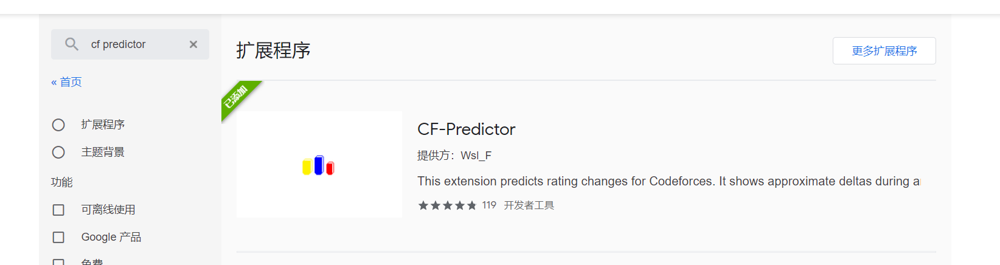

---
- latex：true
---

codeforces 简单介绍

author：SoberShrimp

### 网站
[官方 https://codeforces.com/](https://codeforces.com/)
[镜像站1 https://codeforces.ml/](https://codeforces.ml/)
[镜像站2 https://codeforc.es/](https://codeforc.es/)

### 评分系统

|Rating|Rank|Color|
|---|---|---|
|$x\lt$ 1200|newbie|灰色 |
|$1200 \le x\le 1399$|pupil|绿色|
|$1400\le x\le1599$|specialist|青色|
|$1600\le x\le1899$|expert|蓝色|
|$1900\le x\le 2099$|candidate master|紫色|
|$2100\le x \le 2299$|master|黄色|
|$2300\le x \le 2399$|international master|深黄色|
|$2400\le x\le 2599$|grandmaster|红色|
|$2600\le x \le 2999$|international grandmaster|深红色|
|$x \ge 3000$|legendary grandmaster|黑红色|

### 比赛类型
Div.1，Div.2，Div.3和Educational Round 和 div.4 和Global  

div4 比较少 就出过一场
div3 1600分以下的计分  适合新手的  ak的话也挺有希望的 

div2  div1  同一个场次分为两场时候 1900 分及其以上只能参加div1  1900分以下只能参加div2

div2 单独出一场 2100 分以下都是rated 

edu 场 2100分以下都是计分的

global 和一些特殊的场 都是针对所有人的。

div3 edu 是有赛后hack的。分数是按照时间制度。（提交一次不对10分钟的罚时）。
其他的是按照分数制度（提交一次不对的话扣50分）
算成绩是按照你的现有分数根据复杂公式（俺也不知道）给你一个预期排名，你打得越好（排名越靠前），加分越多。

打比赛的话只要看rated 还是unrated

### gym场

开启coach mode：
上紫（1900） 并20/30？场
上黄（2100）

### 注册一场比赛
打比赛想要计分的话得事先注册过

1.点击你想打的比赛的Register

2.确定以参赛者的身份注册

3.注册完成后会有  Registration completed的字样。这样你打计分的比赛你就会计分了。
### 交题目
以goodbye 2020为例。

右边16475 14976 10106 这些是通过的人数，你可以通过人数判断题目难度，在比赛过程中也可以通过这个调整做题策略。

一般来说难度是按照顺序递增，但由于种种情况，可能会存在d题比c题简单，或者e题很水，b题很难的情况。

点击my submissions 之后会看到你的提交记录。

点击standings之后会看到榜，如下：

双击一下就能看别人代码。
点击friend standings 就能看好友的情况。

提交代码时候，你可以文件方式，也可以复制粘贴代码。

选语言时候一般用GNU G++ 系列，一般选GNU G++ 11 5.1.0 就行。
如果你用了__int128 选GNU G++ 17 9.2.0 （64bit ,msys 2）
有时候存在选11能ac 选17 tle，这种情况是正常的。还有一些情况（用一种ac用另一种ce）可能你的代码写出了ub（undefined behavior）了，就是你认为这样写是这样的但是编译器没给定义，这种时候挺糟糕的。。

emmm，最快的话一般是14，但是14在某些情况下因为大力优化导致没有11表现好，如果没有用到17的特性的话一般用11交是比较好的。（当然如果你出现17ac 11tle的情况我也不敢保证，但我觉得不会出现这样的情况把qwq？）
### CF-Predictor 插件
预测自己升降多少分。
https://chrome.google.com/webstore/search/cf%20predictor?hl=zh-CN

### 他山之石
https://www.luogu.com.cn/blog/ezoixx130/codeforces-tutorial

